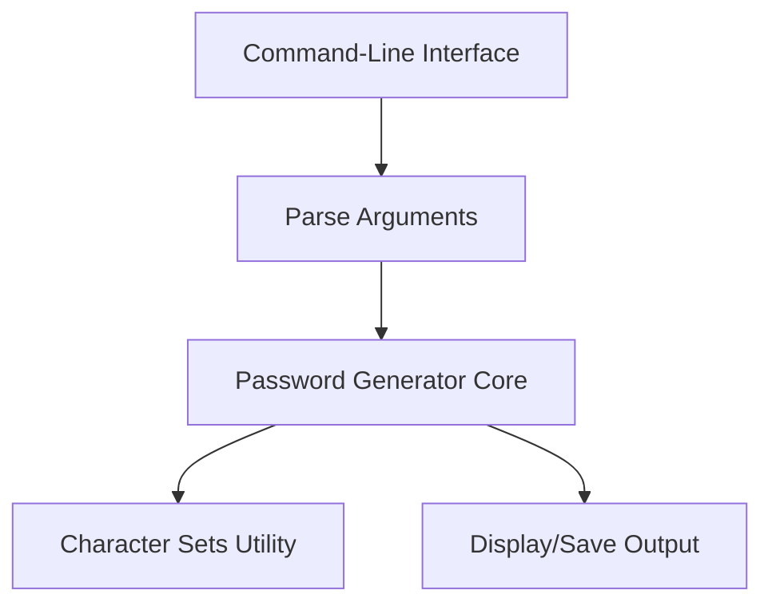

# Advanced Password Generator

Advanced Password Generator is a flexible and powerful tool designed to generate secure, customizable passwords. Built with user security and convenience in mind, it offers various options and configuration settings to help users create strong passwords for personal, professional, or enterprise use.

## Introduction

This repository provides a robust password generation utility that allows users to create random, secure passwords based on their specific requirements. Whether you need complex passwords for system accounts or simple passwords for regular use, this tool accommodates a wide range of use cases.

## Features

- Generate random passwords of customizable length.
- Configure inclusion of uppercase, lowercase, numbers, and special characters.
- Option to avoid ambiguous characters for better readability.
- Command-line interface for easy interaction.
- Support for generating multiple passwords at once.
- Easily extendable and modifiable for additional features.

## Requirements

To use Advanced Password Generator, ensure you have the following:

- Python 3.7 or higher
- Standard library dependencies only (no external packages required)

## Installation

Follow these steps to install and set up the Advanced Password Generator:

1. Clone the repository:
    ```bash
    git clone https://github.com/harshitchauhann95/Advanced-Password-Generator.git
    cd Advanced-Password-Generator
    ```
2. Make sure Python is installed:
    ```bash
    python --version
    ```
3. You are ready to use the tool; no additional dependencies are required.

## License

This project is licensed under the MIT License. You are free to use, modify, and distribute this software, provided you include the original copyright and license.

## Contributing

We welcome contributions to improve the Advanced Password Generator. To contribute:

- Fork the repository and create your branch from `main`.
- Make your changes with clear, descriptive commit messages.
- Ensure code is well-documented and follows project conventions.
- Submit a pull request with a detailed description of your changes.

## Configuration

Advanced Password Generator can be configured using command-line arguments:

- `-l` or `--length`: Set password length (default: 12).
- `-n` or `--number`: Number of passwords to generate (default: 1).
- `-u` or `--uppercase`: Include uppercase letters.
- `-lc` or `--lowercase`: Include lowercase letters.
- `-d` or `--digits`: Include digits.
- `-s` or `--special`: Include special characters.
- `-a` or `--avoid-ambiguous`: Exclude ambiguous characters.
- `-h` or `--help`: Show the help message.

You can combine these arguments to fine-tune password generation according to your requirements.

## Usage

Use the command line to generate passwords. Here are some usage examples:

- Generate a single 16-character password with all character types:
    ```bash
    python password_generator.py --length 16 --uppercase --lowercase --digits --special
    ```

- Generate 5 passwords of 20 characters, avoiding ambiguous characters:
    ```bash
    python password_generator.py --length 20 --number 5 --avoid-ambiguous
    ```

- View help and all options:
    ```bash
    python password_generator.py --help
    ```

### Example Output

```
Generated Passwords:
1: w8Z!rDq3p@s6
2: Y4#dL9v%2gXp
...
```

## Architecture Overview

The Advanced Password Generator follows a simple, modular structure—making it easy to maintain and extend.



This diagram illustrates the flow from user input to password output, highlighting how arguments control the password generation process.

---

For any questions, feature requests, or issues, feel free to open an issue or contact the repository maintainer. Happy password generating!
